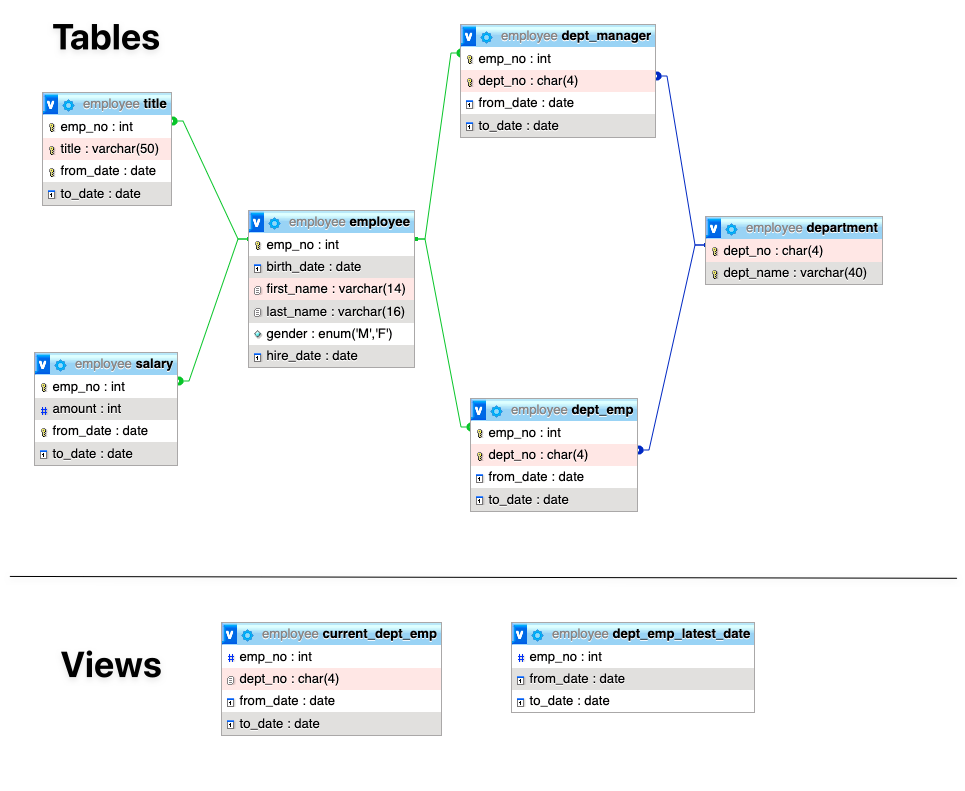

# Employee Sample Database for MySQL

This repo is based on the work from https://github.com/datacharmer/test_db with the following improvements:

1. Create 2 separate datasets:

   a. dataset_full (~170 MB). This is the same as the original one.

   b. dataset_small (~6 MB). ~3% of the dataset_full (10000 employees vs 300024 employees).

1. Only keep md5 to verify the data installation, remove SHA. There is no need to maintain 2 methods to verify the data.

1. Remove unnecessary files.

## Schema

## Prerequisites

You need a MySQL database server (5.0+) and run the commands below through a
user that has the following privileges:

    SELECT, INSERT, UPDATE, DELETE,
    CREATE, DROP, RELOAD, REFERENCES,
    INDEX, ALTER, SHOW DATABASES,
    CREATE TEMPORARY TABLES,
    LOCK TABLES, EXECUTE, CREATE VIEW

## Installation:

1. Download the repository
2. Change directory to the repository
3. Change directory to either `dataset_full` or `dataset_small`

Run

    cd dataset_full

or

    cd dataset_small

Then run

    mysql < employees.sql

## Testing the installation

### Testing `dataset_full`

    // Under 'dataset_full' directory
    mysql -t < test_employees_md5.sql

    +----------------------+
    | INFO                 |
    +----------------------+
    | TESTING INSTALLATION |
    +----------------------+
    +--------------+------------------+----------------------------------+
    | table_name   | expected_records | expected_crc                     |
    +--------------+------------------+----------------------------------+
    | departments  |                9 | d1af5e170d2d1591d776d5638d71fc5f |
    | dept_emp     |           331603 | ccf6fe516f990bdaa49713fc478701b7 |
    | dept_manager |               24 | 8720e2f0853ac9096b689c14664f847e |
    | employees    |           300024 | 4ec56ab5ba37218d187cf6ab09ce1aa1 |
    | salaries     |          2844047 | fd220654e95aea1b169624ffe3fca934 |
    | titles       |           443308 | bfa016c472df68e70a03facafa1bc0a8 |
    +--------------+------------------+----------------------------------+
    +--------------+------------------+----------------------------------+
    | table_name   | found_records    | found_crc                        |
    +--------------+------------------+----------------------------------+
    | departments  |                9 | d1af5e170d2d1591d776d5638d71fc5f |
    | dept_emp     |           331603 | ccf6fe516f990bdaa49713fc478701b7 |
    | dept_manager |               24 | 8720e2f0853ac9096b689c14664f847e |
    | employees    |           300024 | 4ec56ab5ba37218d187cf6ab09ce1aa1 |
    | salaries     |          2844047 | fd220654e95aea1b169624ffe3fca934 |
    | titles       |           443308 | bfa016c472df68e70a03facafa1bc0a8 |
    +--------------+------------------+----------------------------------+
    +--------------+---------------+-----------+
    | table_name   | records_match | crc_match |
    +--------------+---------------+-----------+
    | departments  | OK            | ok        |
    | dept_emp     | OK            | ok        |
    | dept_manager | OK            | ok        |
    | employees    | OK            | ok        |
    | salaries     | OK            | ok        |
    | titles       | OK            | ok        |
    +--------------+---------------+-----------+
    +------------------+
    | computation_time |
    +------------------+
    | 00:00:38         |
    +------------------+
    +---------+--------+
    | summary | result |
    +---------+--------+
    | CRC     | OK     |
    | count   | OK     |
    +---------+--------+

### Testing `dataset_small`

    // Under 'dataset_small' directory
    mysql -t < dataset_small/test_employees_md5.sql

    +----------------------+
    | INFO                 |
    +----------------------+
    | TESTING INSTALLATION |
    +----------------------+
    +--------------+------------------+----------------------------------+
    | table_name   | expected_records | expected_crc                     |
    +--------------+------------------+----------------------------------+
    | departments  |                9 | d1af5e170d2d1591d776d5638d71fc5f |
    | dept_emp     |            11051 | fc43a976d1406705d9707f6fea1df9df |
    | dept_manager |               24 | 953e3c0c8360805645498ada817b66e9 |
    | employees    |            10000 | 2b9ee8043563317634407daf42a9ef0b |
    | salaries     |            94917 | 0fcb81f97f6b0eacb01a22a085e6512d |
    | titles       |            14782 | ffa808be19d75619f415e2964cbe0320 |
    +--------------+------------------+----------------------------------+
    +--------------+------------------+----------------------------------+
    | table_name   | found_records    | found_crc                        |
    +--------------+------------------+----------------------------------+
    | departments  |                9 | d1af5e170d2d1591d776d5638d71fc5f |
    | dept_emp     |            11051 | fc43a976d1406705d9707f6fea1df9df |
    | dept_manager |               24 | 953e3c0c8360805645498ada817b66e9 |
    | employees    |            10000 | 2b9ee8043563317634407daf42a9ef0b |
    | salaries     |            94917 | 0fcb81f97f6b0eacb01a22a085e6512d |
    | titles       |            14782 | ffa808be19d75619f415e2964cbe0320 |
    +--------------+------------------+----------------------------------+
    +--------------+---------------+-----------+
    | table_name   | records_match | crc_match |
    +--------------+---------------+-----------+
    | departments  | OK            | ok        |
    | dept_emp     | OK            | ok        |
    | dept_manager | OK            | ok        |
    | employees    | OK            | ok        |
    | salaries     | OK            | ok        |
    | titles       | OK            | ok        |
    +--------------+---------------+-----------+
    +------------------+
    | computation_time |
    +------------------+
    | 00:00:01         |
    +------------------+
    +---------+--------+
    | summary | result |
    +---------+--------+
    | CRC     | OK     |
    | count   | OK     |
    +---------+--------+

## Installing the function (optional)

    mysql < objects.sql

**If you are connecting to a cloud instance such as AWS RDS. You MUST turn off binary logging first. Otherwise, you will encounter error**

    You do not have the SUPER privilege and binary logging is enabled (you *might* want to use the less safe log_bin_trust_function_creators variable)
